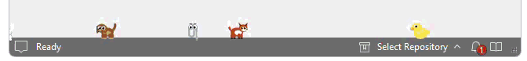
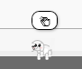
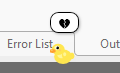
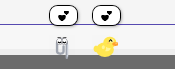
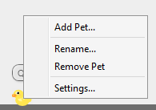
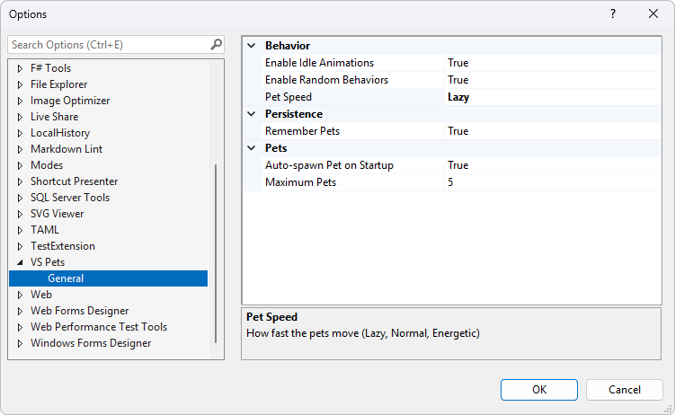

# VS Pets 🐱🐕🦊

**Bring your Visual Studio to life with adorable animated pets that walk along your status bar!**

Watch cats, dogs, foxes, and more stroll across the bottom of your IDE while you code. Your pets have unique personalities—they walk, run, sleep, and even react to your builds!

Download from the [Visual Studio Marketplace](https://marketplace.visualstudio.com/items?itemName=MadsKristensen.VSPets) or install from within Visual Studio via **Extensions > Manage Extensions**.

---

## ✨ Features

### 🐾 Animated Companions

Your pets come to life with smooth walking animations. Watch their little legs move as they explore your status bar!

### 🎉 Build Awareness

Your pets celebrate with you! They show 🎉 when builds succeed and 😢 when they fail.

Build succeeded:  

Build failed:  

### 👋 Social Pets

When two pets meet, they greet each other with a friendly wave! Each pet has its own personality with different speeds and behaviors.

### 🎨 Multiple Pet Types

Choose from a variety of pets:

- 🐱 **Cats** - Orange, black, white, gray, and brown
- 🐕 **Dogs** - Various colors including Shiba Inu style
- 🦊 **Foxes** - Classic orange and arctic white
- 🐺 **Wolves** - Gray, white, and dark gray - majestic and loyal!
- 🐻 **Bears** - Brown grizzly, black bear, and white polar bear
- 🦎 **Axolotls** - Pink, blue, gold, white, and black
- 🐢 **Turtles** - Green, brown, and gray - slow and steady!
- 🐰 **Bunnies** - White, brown, gray, and more - fluffy tails!
- 🦝 **Raccoons** - Gray and dark gray trash pandas with masks
- 🦖 **T-Rex** - Green, brown, purple, red - tiny arms, big personality!
- 📎 **Clippy** - The legendary Office assistant returns!
- 🦆 **Rubber Duck** - Multiple colors: yellow, white, black, blue, pink, gold, and orange

### 🖱️ Easy Interaction

Right-click any pet to:

- **Add Pet** - Quickly add another companion
- **Rename** - Give your pet a custom name
- **Remove** - Say goodbye (they'll wave! 👋)
- **Settings** - Access VS Pets options

### ⚙️ Fully Configurable

Access settings via **Tools > Options > VS Pets**:

- Auto-spawn on startup
- Pet speed (Lazy → Hyper)
- Idle animations toggle
- Random behaviors toggle
- Session persistence

---

## 🚀 Getting Started

1. Install the extension from Visual Studio Marketplace
2. A pet will automatically appear on your status bar
3. Right-click the pet to add more friends!
4. Access **Extensions > VS Pets** menu for more options

---

## 📋 Menu Commands

| Command | Description |
|---------|-------------|
| Add Cat | Add a random cat to your status bar |
| Add Dog | Add a random dog to your status bar |
| Add Fox | Add a fox to your status bar |
| Add Wolf | Add a wolf to your status bar |
| Add Bear | Add a bear to your status bar |
| Add Axolotl | Add an axolotl to your status bar |
| Add Turtle | Add a turtle to your status bar |
| Add Bunny | Add a bunny to your status bar |
| Add Raccoon | Add a raccoon to your status bar |
| Add T-Rex | Add a T-Rex to your status bar |
| Add Clippy | Bring back the classic Office assistant |
| Add Rubber Duck | Add a debugging companion |
| Remove All Pets | Clear all pets from the status bar |

---

## 🎮 Pet Behaviors

Your pets aren't just decorations—they have personality!

| Behavior | What happens |
|----------|--------------|
| 🚶 Walking | Pets stroll across the status bar |
| 🏃 Running | Sometimes they get energetic! |
| ⚾ Chasing | Double-click to throw a ball - pets chase it! |
| 💤 Sleeping | Pets take naps with Zzz bubbles |
| 🥱 Yawning | Random idle behavior |
| 😌 Stretching | Pets stay limber |
| 👀 Looking around | Curious pets explore |
| 🐾 Ear twitch | Subtle idle animations |
| 😊 Tail wag | Happy pets wag their tails |

---

## 💡 Tips

- **Double-click a pet** to throw a ball and watch them chase it!
- **Drag pets** to reposition them along the status bar
- **Pets remember their names** across Visual Studio sessions
- **White pets have outlines** so they're visible on light themes
- **Pets walk off-screen** and re-enter from either side
- **Each pet is unique** with slightly different speeds and behaviors
- **Hover over a pet** to see their name

---

## 🤝 Contributing

Found a bug or have a feature request? Please open an issue on [GitHub](https://github.com/madskristensen/VSPets/issues).

Want to add a new pet type? Pull requests are welcome!

---

## 🙏 Acknowledgements

This extension was inspired by [VS Code Pets](https://tonybaloney.github.io/vscode-pets/) by [Anthony Shaw (tonybaloney)](https://github.com/tonybaloney). VS Code Pets is a fantastic extension that brings pets to VS Code's explorer panel with throwable balls and themed backgrounds.

VS Pets takes a different approach—pets walk along the Visual Studio status bar and react to your builds. Double-click any pet to throw a ball and watch them chase it!

Check out [VS Code Pets](https://marketplace.visualstudio.com/items?itemName=tonybaloney.vscode-pets) if you're a VS Code user!

---

**Made with ❤️ for developers who appreciate a little joy in their IDE.**
